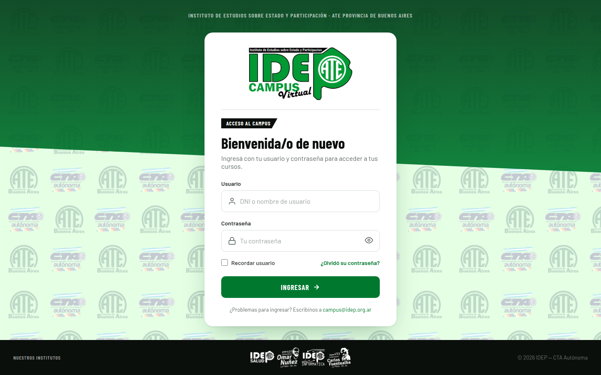
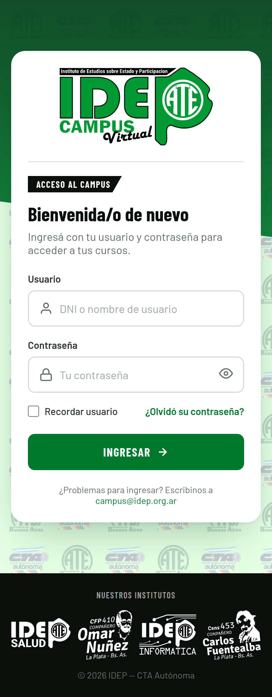

# Campus IDEP — Login UI

Maqueta visual (HTML + CSS) de la pantalla de inicio de sesión del **Campus Virtual IDEP**
(Instituto de Estudios sobre Estado y Participación — ATE Provincia de Buenos Aires / CTA Autónoma),
pensada para portarse al tema de Moodle `theme_idep`.

No es un login funcional: es la referencia visual y de estilos para la plantilla `core/loginform`.

## Vista previa

| Desktop (1440 × 900) | Mobile (390) |
|---|---|
|  |  |

Para verla en vivo alcanza con abrir [`index.html`](index.html) en el navegador (no requiere build ni servidor).

## Estructura

```
index.html                     Maqueta completa: HTML + un único <style>, sin frameworks
images/                        Assets de marca
  campusLogoSolo.png           Logo principal (siempre sobre blanco)
  campusLogoCompleto.png       Logo + fila de institutos
  institutos-fila.png          Fila de los 4 institutos (negro; se invierte a blanco en el footer)
  fondocampus.png              Patrón tileado ATE / CTA Autónoma
docs/screenshots/              Capturas usadas en este README
.superdesign/design-system.md  Sistema de diseño (paleta, tipografía, espaciados, reglas de marca)
prompts/                       Brief original y prompts usados para generar el diseño
.claude/skills/superdesign/    Skill de Superdesign para seguir iterando con Claude Code
CLAUDE.md                      Instrucciones del proyecto para agentes
```

## Composición

- **Fondo**: patrón institucional tileado (`fondocampus.png`, 540px; 360px en mobile) con una banda
  verde superior (`#003d18 → #00792f`, 92% de opacidad) cortada en diagonal, como la cinta negra del logo.
- **Tarjeta única centrada** (máx. 460px, radio 20px) montada sobre el borde de la banda:
  logo sobre blanco → divisor → etiqueta negra inclinada "ACCESO AL CAMPUS" → título → formulario.
- **Formulario**: Usuario, Contraseña (con mostrar/ocultar), "Recordar usuario",
  "¿Olvidó su contraseña?", botón **INGRESAR** y línea de ayuda.
- **Footer** negro con la fila de institutos invertida a blanco (`filter: invert(1)`).
- Sin selector de idioma, aviso de cookies, estadísticas genéricas ni acceso de invitados.

## Tokens

| Token | Valor | Uso |
|---|---|---|
| `--idep-green` | `#00792f` | Primario: botón, links, foco |
| `--idep-green-700` | `#005f25` | Hover |
| `--idep-green-900` | `#003d18` | Banda superior |
| `--idep-green-50` | `#e8f5ec` | Halo de foco |
| `--idep-mint` | `#e5ffe5` | Base del patrón |
| `--ink` | `#0b0f0c` | Títulos, etiqueta, footer |
| `--ink-700` / `--ink-500` | `#2b322d` / `#5f6b63` | Texto / texto secundario |
| `--line` | `#d6ddd8` | Bordes de inputs, divisores |

- **Tipografía**: [Barlow Condensed](https://fonts.google.com/specimen/Barlow+Condensed) 600–800 para
  títulos, etiquetas y botón; [Barlow](https://fonts.google.com/specimen/Barlow) 400–600 para el texto.
- **Medidas**: inputs y botón de 52px con radio 10px; foco = borde verde + halo de 4px;
  tarjeta con padding 36/40px (24px en mobile); breakpoint mobile en `600px`.

## Portar a `theme_idep`

1. Reemplazar las rutas `images/...` por los assets del tema (`{{#pix}}` / `$OUTPUT->image_url()`).
2. En el `<form>`: `action="{{loginurl}}"`, `method="post"`, `name="username"`, `name="password"`,
   `name="rememberusername"` y el `<input type="hidden" name="logintoken">`.
3. Apuntar "¿Olvidó su contraseña?" a `{{forgotpasswordurl}}`.
4. Reemplazar el mail de ayuda de ejemplo (`campus@idep.org.ar`) por el real.
5. El `<script>` de mostrar/ocultar contraseña es solo para la maqueta.

## Diseño

Generado con [Superdesign](https://superdesign.dev) a partir del brief en
[`prompts/brief.md`](prompts/brief.md), con ajustes manuales documentados en
[`prompts/superdesign-login.md`](prompts/superdesign-login.md).

## Licencia

[MIT](LICENSE) © 2026 Cristian O. Giambruni.

Los logos y marcas (IDEP, ATE, CTA Autónoma y los institutos) pertenecen a sus respectivas
organizaciones y no están cubiertos por la licencia MIT.
